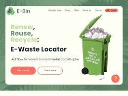
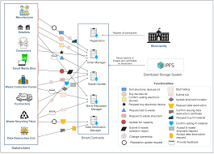

# Smart India Hackathon Workshop
# Date:13-05-2024
## Register Number:212223040132
## Name:NIKESHKUMAR C
## Problem Title
E-Waste Facility Locator
## Problem Description
Website that tells you the location of the nearest e-waste collection and recycling facility. Offers educational pop-ups on the harmful components of your e-waste and their effects on the environment and human health if not disposed correctly. There could be an option to input the model of your old device and earn credit points relative to the amount of precious metals recovered from the device if disposed correctly.
## Problem Creater's Organization
Ministry of Environment

## Idea

1.Database Creation: Start by compiling a comprehensive database of e-waste recycling facilities worldwide. Collaborate with local governments, environmental organizations, and recycling companies to gather accurate and up-to-date information.

2.Online Platform: Develop a user-friendly online platform and mobile application where users can easily search for nearby e-waste facilities based on their location. Include filters such as types of electronic devices accepted, operating hours, and contact information.

3.Geolocation Services: Implement geolocation services to automatically detect the user's location and provide a list of nearby e-waste facilities. This feature enhances convenience and encourages more people to participate in e-waste recycling.

4.Information Hub: Provide educational resources about the importance of e-waste recycling, environmental impact, and tips for responsible disposal. This information can help raise awareness and encourage more people to recycle their electronic devices.

5.User Reviews and Ratings: Allow users to leave reviews and ratings for e-waste facilities they have visited. This feature helps other users make informed decisions and ensures transparency in the recycling process.

6.Partnerships and Sponsorships: Collaborate with local businesses, municipalities, and environmental organizations to promote the E-Waste Facility Locator. Seek sponsorships to fund the development and maintenance of the platform.

7.Community Engagement: Organize outreach events, workshops, and awareness campaigns to engage the community and promote e-waste recycling. Encourage schools, businesses, and community groups to participate in recycling drives.

8.Continuous Improvement: Regularly update the database and platform to ensure accuracy and usability. Incorporate user feedback to make necessary improvements and add new features to enhance the user experience

## Proposed Solution / Architecture Diagram

## Use Cases

Individual Consumers:

John has an old printer and laptop he wants to dispose of responsibly. He uses the E-Waste Facility Locator app to find the nearest recycling center that accepts electronic devices. He checks the operating hours and drops off his e-waste on his way to work.
Businesses:

ABC Electronics, a local tech company, is upgrading its office equipment and needs to dispose of old computers and monitors. The office manager uses the E-Waste Facility Locator website to find a recycling center that offers pickup services for bulk e-waste. They schedule a pickup and ensure their old electronics are recycled properly.
Schools and Universities:

Green Valley High School is organizing an e-waste recycling drive as part of their Earth Day initiatives. The school administration uses the E-Waste Facility Locator to find nearby recycling facilities that accept donations from the community. They promote the event and encourage students and families to bring in their old electronics for recycling.
Local Governments:

The environmental department of a city government wants to promote e-waste recycling among residents. They integrate the E-Waste Facility Locator into their official website and provide information about local recycling centers and upcoming recycling events. This encourages more residents to participate in e-waste recycling efforts.
Non-profit Organizations:

A local environmental NGO wants to raise awareness about the importance of e-waste recycling in low-income communities. They use the E-Waste Facility Locator to identify nearby recycling centers and organize community workshops on proper e-waste disposal. They also collaborate with the recycling facilities to provide discounts or incentives for residents who recycle their electronics.
Tech Repair and Retail Shops:

A computer repair shop wants to offer e-waste recycling services to its customers. They partner with a nearby recycling facility listed on the E-Waste Facility Locator to collect old electronics from customers for recycling. This helps the repair shop attract environmentally-conscious customers and ensures that e-waste is disposed of responsibly.

## Technology Stack

Frontend (Web and Mobile App):

JavaScript Framework: React.js for building dynamic and interactive user interfaces for both web and mobile applications.
React Native (for Mobile): Enables cross-platform mobile app development using React.js syntax.
CSS Framework: Bootstrap or Material-UI for responsive design and UI components.
Map Integration: Google Maps API or Mapbox API for displaying interactive maps and geolocation services.
State Management: Redux or Context API for managing application state efficiently.
GraphQL or REST APIs: Interface with the backend server to fetch data and perform CRUD operations.
Backend:

Programming Language: Node.js or Python for backend server development.
Web Framework: Express.js (for Node.js) or Flask/Django (for Python) for building RESTful APIs.
Database: MongoDB, PostgreSQL, or MySQL for storing e-waste facility data and user information.
Authentication and Authorization: JSON Web Tokens (JWT) or OAuth 2.0 for securing API endpoints and user authentication.
Geocoding and Geolocation Services: Integration with services like Google Maps Geocoding API or Mapbox Geocoding API to convert addresses into geographic coordinates and vice versa.
File Storage: Amazon S3 or Google Cloud Storage for storing images and documents related to e-waste facilities.
Websockets (Optional): Implement real-time features such as notifications or chat using Websockets technology (e.g., Socket.io).
DevOps and Deployment:

Containerization: Docker for containerizing the application components.
Orchestration: Kubernetes for managing containerized applications in a clustered environment (optional for scalability).
Continuous Integration/Continuous Deployment (CI/CD): Jenkins, CircleCI, or GitHub Actions for automating the build, test, and deployment process.
Cloud Platform: AWS (Amazon Web Services), Google Cloud Platform, or Microsoft Azure for hosting the application and database.
Monitoring and Logging: Prometheus for monitoring application metrics, and ELK stack (Elasticsearch, Logstash, Kibana) for centralized logging and log analysis.
Other Tools and Libraries:

API Documentation: Swagger or OpenAPI for documenting API endpoints.
Testing Frameworks: Jest for unit testing (frontend), and PyTest or Mocha for backend testing.
Version Control: Git for source code management, hosted on platforms like GitHub or GitLab.

## Dependencies
 Mapping Services – 25 Days,Data Collection – 30 Days,Estimated Budget – Rs.45,0000

